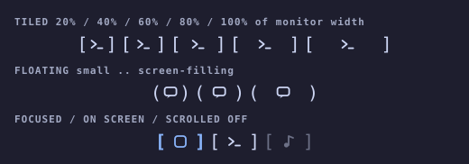

# Scroll Map

A bar widget for the **Hyprland scrolling layout**. It draws a live mini-map of
the windows on this monitor's active workspace. Each window is a bracketed
glyph at full bar height, in the same order the layout shows them. The
padding inside the brackets shows how big the window is. The colour shows
where the window is: focused, on screen or scrolled off. Click a window to
focus it.

Outside the scrolling layout the widget shows `only for scrollable layout` and
does nothing else.

*If Scroll Map is useful to you, consider [buying me a coffee](https://buymeacoffee.com/jgarza97885).*


[▶️ YouTube Video Demo](https://www.youtube.com/watch?v=rfmkSCV7xyw)

## Reading the strip

### Size — padding

The padding inside the brackets grows **continuously** with the window, so
even a small resize nudges the brackets:

| Tiled | Floating | Window size |
|---|---|---|
| `[󰖟]` | `(󰖟)` | tiny |
| `[ 󰖟 ]` | `( 󰖟 )` | about half the monitor |
| `[  󰖟  ]` | `(  󰖟  )` | the full monitor |

A window's **size** is its width ÷ the monitor width when tiled, or
√(its area ÷ the monitor area) when floating, so floats grow at the same rate
as their side length. Padding per side is then size<sup>curve</sup> ×
`padRange`. With the default curve of 2.0 the growth is convex: big windows
get disproportionately more padding, so the big one is easy to spot, and
small windows stay compact. A curve of 1.0 is linear. Padding changes tween
smoothly. On a vertical bar the brackets turn a quarter
turn and cap each window from above and below. There, tiled windows are
measured by height instead.

### Colour — position

| State | Look |
|---|---|
| Focused | Brackets and glyph in the theme **accent** colour, bold |
| On screen | Brackets and glyph in the theme **foreground** colour |
| Scrolled off | Brackets and glyph in the theme **muted** colour |

Colours are read live from the active theme's
`~/.local/state/omarchy/current/theme/colors.toml`, so a theme switch
recolours the strip immediately. If a theme's `muted` would disappear against
the bar, it is lifted toward the foreground.



### Labels

`iconMode` — `icons` (default), `nerdfont`, `shortname`, `none`:


Both images are mock-ups, not screenshots. Regenerate them with
`python3 previews/generate_previews.py`.

## Animations

### On focus change (`focusAnimation`, pick one)

| Value | Look |
|---|---|
| `none` | Focus only changes colour. |
| `bracketSnap` *(default)* | The brackets fly in from wide and clamp onto the glyph with a little overshoot. |
| `slideCursor` | An accent underline glides from the old focused window to the new one. |
| `breathe` | The brackets pulse outward three times, calm and heartbeat-like, then settle. |
| `pop` | The glyph scales up briefly and springs back. |
| `hyprPop` | A big multi-stage bounce with a rotation wobble and an expanding shockwave ring. Deliberately over the top. |
| `glitch` | Rapid position jitter, an accent flash, and a cyan/magenta chromatic fringe on the brackets. |
| `neon` | Brackets and glyph flicker through lighter and darker versions of the theme accent, like a tube lighting up. |

`pop`, `hyprPop`, `glitch` and `neon` are adapted from
[workspace-styles](https://github.com/jgarza9788/workspace-styles).

### On layout change (independent toggles)

| Key | Look |
|---|---|
| `animUnfold` | When an app opens, its window unfolds out of `][` into its brackets while the glyph grows in. When an app closes, its window folds back to `][` and fades out. This plays only for real launches and exits (Hyprland's `openwindow` / `closewindow` events). Windows that come and go because you switched workspace, moved a window away, or filtered out a float swap in and out instantly. |
| `animFloatLift` | Toggling floating makes the window hop while `[ ]` morphs into `( )`. |

Resizing a window always tweens its padding, and the strip
slides its windows into place when they reorder.

## Behaviour

- **Scope**: tiled, mapped windows on the active workspace of the monitor
  the bar is on. Each monitor's bar shows its own workspace, not the one with
  keyboard focus. Floating windows are left out by default. Enable
  `showFloating` to slot them in by position, drawn with `( )`.
- **Order**: sorted by global X, or by Y on a vertical bar.
- **Overflow**: when the strip would be wider than `maxWidth`, padding
  shrinks proportionally first, down to `[x]`. If it still overflows, the strip clips
  and scrolls to keep the focused window centred. The edges fade to show
  there is more.
- **Hover**: a faint wash behind the window. The tooltip shows the window
  title.
- **Click**: left-click a window to `hl.dsp.focus` / `focuswindow` it.
  Right-click anywhere on the widget for the settings popup.
- **Updates**: driven by Hyprland events (open, close, move, float,
  workspace). A short fast-poll afterwards follows the scroll animation to
  rest, and a slow safety poll catches viewport shifts that raise no event.

## Settings

Right-click the widget for a tabbed popup (**Labels**, **Animation**,
**Strip**), or edit the keys directly in `~/.config/omarchy/shell.json`.

| Key | Default | Meaning |
|---|---|---|
| `iconMode` | `icons` | What sits inside the brackets: `icons`, `nerdfont`, `shortname`, or `none`. |
| `nameLength` | `3` | Characters per window in `shortname` mode (1–4). |
| `focusAnimation` | `bracketSnap` | One of the focus animations above. |
| `animUnfold` | `true` | Unfold new windows and collapse closed ones. |
| `animFloatLift` | `true` | Hop and morph the brackets when a window toggles floating. |
| `showFloating` | `false` | Include floating windows, drawn with `( )`. |
| `maxWidth` | `360` | Longest the strip may get, in logical px (height on a vertical bar). |
| `padRange` | `36` | Padding per side, in px, for a window as big as the monitor. Raise it to make size differences more visible. |
| `padCurve` | `20` | How padding grows with size, in tenths: padding = size<sup>padCurve / 10</sup>. `10` is linear. Higher values make big windows stand out more. |
| `gap` | `4` | Pixels between windows. |

### Upgrading from 1.x

Old keys are still read, but only when the matching new key isn't set:

- `animate: false` sets `focusAnimation` to `none` and turns off both layout
  animations.
- `showIcons: false` sets `iconMode` to `none`.
- `cellStyle`, `minCell`, `dimInactive` and `showViewport` belonged to the
  rectangle cells and are ignored.

Any choice made in the popup writes the new key, which then takes over.

### Editing `shell.json` by hand

Give the widget entry an object with `id` plus any of the keys above. Keys
you leave out use their defaults:

```json
"center": [
  {
    "id": "jgarza.scrollmap",
    "iconMode": "nerdfont",
    "focusAnimation": "slideCursor",
    "maxWidth": 480
  }
]
```

Unknown values fall back to the defaults. Restart the shell
(`omarchy restart shell`) to pick up the change. Omarchy writes a widget's
settings back into `shell.json` whenever they're changed from the popup, so a
bare `id` may be expanded into the full block after the first edit.

## Layout

Placed in the bar `center` section by default. To pin it as the centre anchor,
set `bar.centerAnchor` to `jgarza.scrollmap` in `~/.config/omarchy/shell.json`.

## Development

```
node tests/model.test.js                     # pure logic unit tests
omarchy-plugin-validate .                     # manifest check
omarchy restart shell                         # reload widget QML (hot-reload is unreliable for bar widgets)
```

Do **not** run `omarchy refresh shell` while iterating, because it resets
`shell.json` to the Omarchy default. If QML edits don't seem to take effect
after a restart, clear the compiled-QML cache with
`rm -rf ~/.cache/quickshell/qmlcache/*`, then run `omarchy restart shell`
again.

`Model.js` holds all the pure logic as ES5, so it runs both in QML and under
Node:

- window filtering and ordering
- window size fractions and viewport state
- padding fit
- delegate-list reconciliation (`syncOps`)
- the label and animation registries
- settings and legacy-key resolution
- the `colors.toml` parser and contrast helpers
