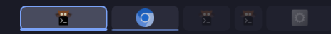
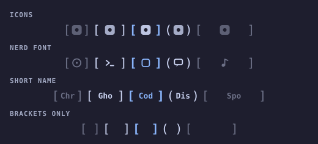
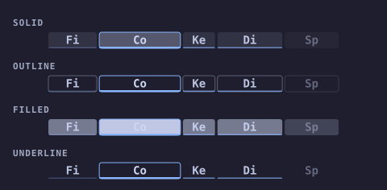

# Scroll Map

A bar widget for the **Hyprland scrolling layout**. It draws a live mini-map of
the windows on this monitor's active workspace: one cell per window, each cell
as wide as the window is on screen, in the same order the layout shows them.
The run of cells currently inside the monitor's viewport is underlined; windows
scrolled off either edge fade out. Click a cell to focus that window.

Outside the scrolling layout the widget shows `only for scrollable layout` and
does nothing else.

*If Scroll Map is useful to you, consider [buying me a coffee](https://buymeacoffee.com/jgarza97885).*

  

[▶️ YouTube Video Demo](https://www.youtube.com/watch?v=rfmkSCV7xyw)

### Cell labels

`iconMode` — `none`, `icons` (default), `nerdfont`, `shortname`. Same sample
strip in each row; the second window is focused, the last is scrolled off:



### Cell styles

`cellStyle` — `solid` (default), `outline`, `filled`, `underline`:



Both are mock-ups, not screenshots — the geometry and shading follow
`Model.computeStrip` and the delegate (the `icons` row stands in for
theme-resolved app icons; the `nerdfont` row for the class-matched glyphs).
Regenerate with `python3 previews/generate_previews.py`.

## Behaviour

- **Scope** — tiled, mapped windows on the active workspace of the monitor the
  bar is on (each monitor's bar shows its own workspace, not wherever keyboard
  focus is). Floating windows are left out by default; enable `showFloating` to
  slot them in by position with a dashed outline.
- **Order** — sorted by global X (by Y on a vertical bar).
- **Proportions** — cell size tracks the window's on-screen width, down to a
  configurable minimum so narrow windows stay clickable.
- **Viewport** — cells whose window is currently visible on the monitor are
  underlined in the accent colour, brightness scaling with how much of the
  window is on screen; fully scrolled-off windows dim.
- **Focus** — the focused window's cell gets an accent border and a solid
  underline.
- **Cell label** — `iconMode` picks what fills each cell: `none` (bare cells),
  `icons` (the installed desktop entry's configured icon, matched directly for
  native apps/PWAs and by `Exec=` hostname for Omarchy web apps; first class
  letter when none resolves), `nerdfont` (a
  Nerd Font glyph matched from the window class, a generic window glyph when
  unmatched), or `shortname` (the class truncated to `nameLength` characters,
  1–4). The `nerdfont` and `shortname` labels are drawn larger and bold, and
  render in cells too narrow for the icon image.
- **Cell style** — `cellStyle` picks how the cell body is drawn: `solid`
  (translucent fill, the default), `outline` (see-through with a thin border on
  every cell), `filled` (opaque high-contrast blocks — labels flip to the bar
  background for contrast), or `underline` (no cell body at all, so only the
  accent tick under on-screen and focused windows shows).
- **Hover** — cells lift and brighten under the pointer; the tooltip shows the
  window title.
- **Click** — left-click a cell to `hl.dsp.focus` / `focuswindow` that window;
  right-click anywhere on the widget for the settings popup.
- **Updates** — driven by Hyprland events (open/close/move/float/workspace),
  with a short fast-poll afterwards to follow the scroll animation to rest and a
  slow safety poll for event-less viewport shifts.

## Settings

Right-click the widget for a popup with real switches and sliders, or edit the
keys directly in `~/.config/omarchy/shell.json`.

| Key | Default | Meaning |
|---|---|---|
| `maxWidth` | `280` | Longest the strip may get (height cap on a vertical bar). |
| `minCell` | `6` | Smallest a single window cell may shrink to. Lower = more true to scale. |
| `gap` | `3` | Pixels between cells. |
| `iconMode` | `icons` | What each cell draws: `none`, `icons`, `nerdfont`, or `shortname`. Falls back to the old boolean `showIcons` when unset. |
| `nameLength` | `3` | Characters per cell in `shortname` mode (1–4). Ignored otherwise. |
| `cellStyle` | `solid` | How the cell body is drawn: `solid`, `outline`, `filled`, or `underline`. |
| `dimInactive` | `true` | Fade every cell except the focused window. |
| `showViewport` | `true` | Underline the windows in the monitor viewport and fade the ones scrolled off. |
| `animate` | `true` | Fade and slide cells as windows open, close, and move. |
| `showFloating` | `false` | Include floating windows, drawn with a dashed outline. |

### Editing `shell.json` by hand

The bar reads these keys straight off the widget's entry in
`~/.config/omarchy/shell.json`. Instead of a bare id, give the entry an object
with `id` plus any of the keys above — anything you leave out falls back to its
default, so you only list what you want to change:

```json
"center": [
  {
    "id": "jgarza.scrollmap",
    "iconMode": "nerdfont",
    "nameLength": 2,
    "maxWidth": 320
  }
]
```

`iconMode` takes `none`, `icons`, `nerdfont`, or `shortname`; an unknown value
just renders as `none`. `cellStyle` takes `solid`, `outline`, `filled`, or
`underline`; an unknown value falls back to `solid`. Restart the shell
(`omarchy restart shell`) to pick up the change.

Omarchy also persists a widget's settings back into `shell.json` whenever
they're changed from the popup or a settings panel, so a bare `id` may get
expanded into the full block after the first edit.

## Layout

Placed in the bar `center` section by default. To pin it as the centre anchor,
set `bar.centerAnchor` to `jgarza.scrollmap` in `~/.config/omarchy/shell.json`.

## Development

```
node tests/model.test.js                     # pure layout-math unit tests
omarchy-plugin-validate .                     # manifest check
omarchy restart shell                         # reload widget QML (hot-reload is unreliable for bar widgets)
```

Do **not** run `omarchy refresh shell` while iterating — it resets `shell.json`
to the Omarchy default.

`Model.js` holds all the geometry math (window filtering, positional ordering,
proportional strip layout, viewport overlap) as ES5 so it runs both in QML and
under Node.
